# Robotics Orchestrator — Diagramas de secuencia

Documentación de los procesos del proyecto `robotics-orchestrator`, generada a partir del código fuente
(`app/`). Cada diagrama indica los módulos implicados para poder ubicarlo en el código.

**Componentes que aparecen en los diagramas**

| Participante | Qué es | Código |
|---|---|---|
| Cliente / Frontend | Robot Control Interface u otro consumidor de la API | — |
| API | Proceso FastAPI (`uvicorn app.main:app`) | `app/main.py`, `app/api/routers/*` |
| Auth | Cliente de autenticación delegada con caché | `app/auth/backend.py`, `app/auth/deps.py` |
| robotics-backend | Servicio externo que emite y valida los JWT | `GET /api/auth/me` |
| Worker | Proceso `python -m app.workers` (consumidores + tareas periódicas) | `app/workers/service.py` |
| Cola | Tabla `clips` usada como cola (`FOR UPDATE SKIP LOCKED`) | `app/queue.py` |
| PostgreSQL | BD + canales `LISTEN/NOTIFY` (`clips_pending`, `detections`) | `app/db/*`, `app/events.py` |
| Flussonic | Servidor de video, exporta tramos del DVR en MP4 | `app/ingest/flussonic.py` |
| ffmpeg | Extracción de frames JPEG | `app/pipeline/frames.py` |
| Servicio IA | Detector HTTP (personas, rostros, objetos…) | `app/detectors/*` |

**Índice**

1. [Arranque de la API](#1-arranque-de-la-api)
2. [Arranque y apagado del worker](#2-arranque-y-apagado-del-worker)
3. [Autenticación de una petición REST](#3-autenticación-de-una-petición-rest)
4. [Alta y edición de cámaras](#4-alta-y-edición-de-cámaras)
5. [Alta de un servicio de IA y activación en una cámara](#5-alta-de-un-servicio-de-ia-y-activación-en-una-cámara)
6. [Solicitud manual de un clip](#6-solicitud-manual-de-un-clip)
7. [Ingesta automática programada](#7-ingesta-automática-programada)
8. [Consumo de la cola (toma de un clip)](#8-consumo-de-la-cola-toma-de-un-clip)
9. [Procesamiento de un clip](#9-procesamiento-de-un-clip)
10. [Llamada a un servicio de detección](#10-llamada-a-un-servicio-de-detección)
11. [Confirmación de alertas (AlertTracker)](#11-confirmación-de-alertas-alerttracker)
12. [Publicación y reparto de eventos en vivo](#12-publicación-y-reparto-de-eventos-en-vivo)
13. [Conexión WebSocket `/ws/events`](#13-conexión-websocket-wsevents)
14. [Atender una alerta](#14-atender-una-alerta)
15. [Consulta de historial (clips, detecciones, alertas)](#15-consulta-de-historial-clips-detecciones-alertas)
16. [Resumen estadístico `/stats/summary`](#16-resumen-estadístico-statssummary)
17. [Recuperación de clips atascados](#17-recuperación-de-clips-atascados)
18. [Limpieza nocturna de videos](#18-limpieza-nocturna-de-videos)
19. [Anexo: ciclo de vida de un clip](#19-anexo-ciclo-de-vida-de-un-clip)

---

## 1. Arranque de la API

`app/main.py` (`lifespan`). Al iniciar se abre una conexión `LISTEN` (EventBus) y otra para publicar
(PostgresEventPublisher). Al apagar se cierran ambas y el cliente HTTP de autenticación.

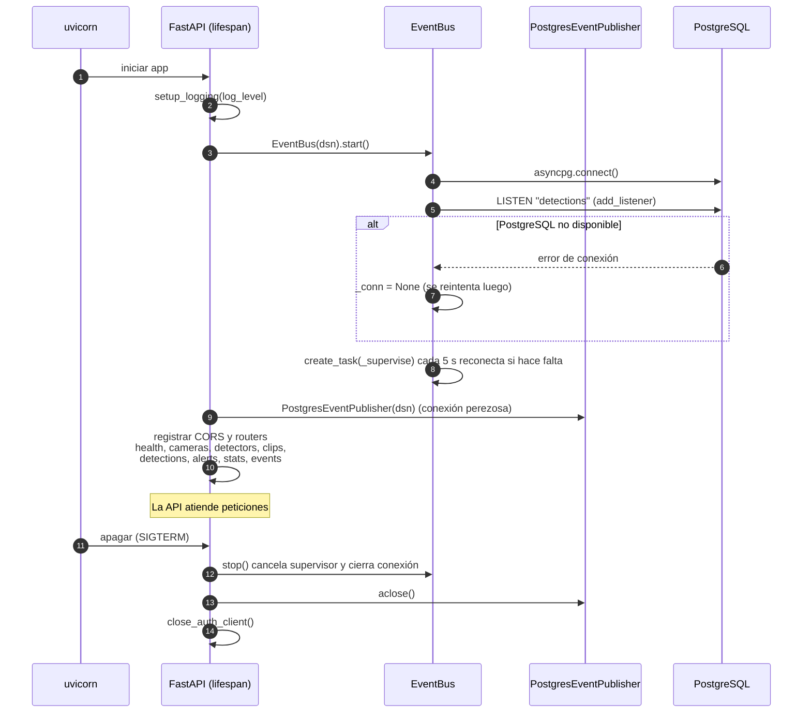
```mermaid
sequenceDiagram
    autonumber
    participant U as uvicorn
    participant API as FastAPI (lifespan)
    participant Bus as EventBus
    participant Pub as PostgresEventPublisher
    participant PG as PostgreSQL

    U->>API: iniciar app
    API->>API: setup_logging(log_level)
    API->>Bus: EventBus(dsn).start()
    Bus->>PG: asyncpg.connect()
    Bus->>PG: LISTEN "detections" (add_listener)
    alt PostgreSQL no disponible
        PG-->>Bus: error de conexión
        Bus->>Bus: _conn = None (se reintenta luego)
    end
    Bus->>Bus: create_task(_supervise) cada 5 s reconecta si hace falta
    API->>Pub: PostgresEventPublisher(dsn) (conexión perezosa)
    API->>API: registrar CORS y routers<br/>health, cameras, detectors, clips,<br/>detections, alerts, stats, events
    Note over API: La API atiende peticiones

    U->>API: apagar (SIGTERM)
    API->>Bus: stop() cancela supervisor y cierra conexión
    API->>Pub: aclose()
    API->>API: close_auth_client()
```

---

## 2. Arranque y apagado del worker

`app/workers/__main__.py` y `Worker.run()` en `app/workers/service.py`.

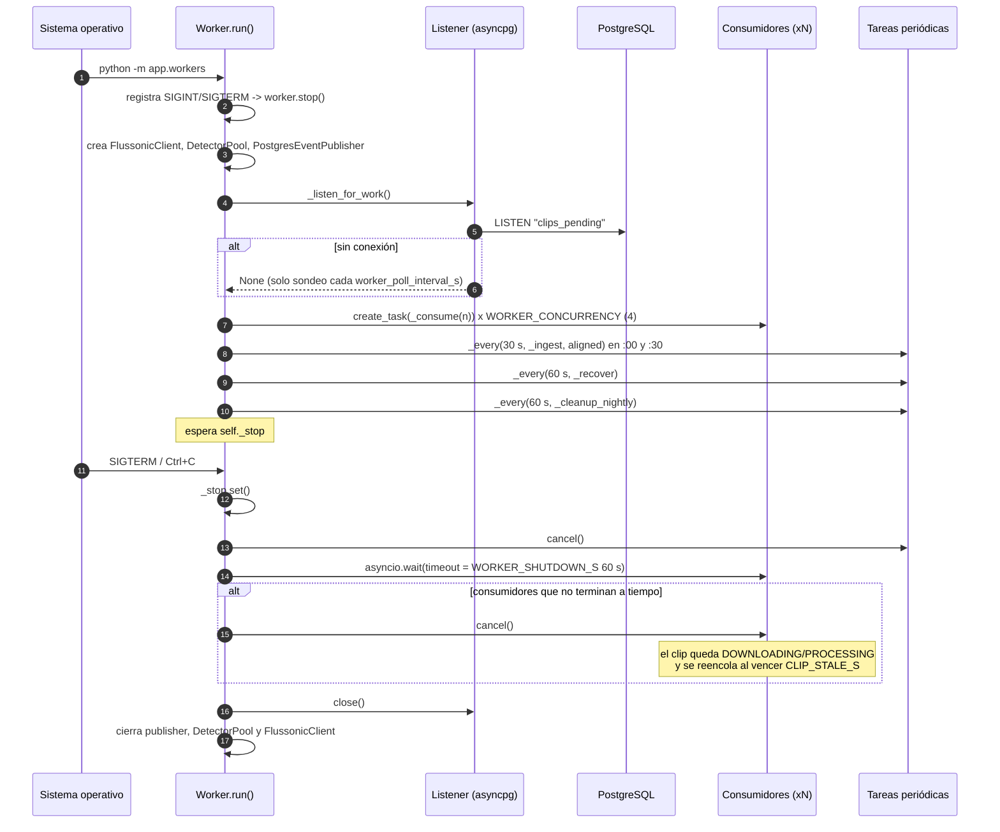
```mermaid
sequenceDiagram
    autonumber
    participant OS as Sistema operativo
    participant W as Worker.run()
    participant L as Listener (asyncpg)
    participant PG as PostgreSQL
    participant C as Consumidores (xN)
    participant T as Tareas periódicas

    OS->>W: python -m app.workers
    W->>W: registra SIGINT/SIGTERM -> worker.stop()
    W->>W: crea FlussonicClient, DetectorPool, PostgresEventPublisher
    W->>L: _listen_for_work()
    L->>PG: LISTEN "clips_pending"
    alt sin conexión
        L-->>W: None (solo sondeo cada worker_poll_interval_s)
    end
    W->>C: create_task(_consume(n)) x WORKER_CONCURRENCY (4)
    W->>T: _every(30 s, _ingest, aligned) en :00 y :30
    W->>T: _every(60 s, _recover)
    W->>T: _every(60 s, _cleanup_nightly)
    Note over W: espera self._stop

    OS->>W: SIGTERM / Ctrl+C
    W->>W: _stop.set()
    W->>T: cancel()
    W->>C: asyncio.wait(timeout = WORKER_SHUTDOWN_S 60 s)
    alt consumidores que no terminan a tiempo
        W->>C: cancel()
        Note over C: el clip queda DOWNLOADING/PROCESSING<br/>y se reencola al vencer CLIP_STALE_S
    end
    W->>L: close()
    W->>W: cierra publisher, DetectorPool y FlussonicClient
```

---

## 3. Autenticación de una petición REST

Dependencias `get_current_user` / `require_admin` (`app/auth/deps.py`) y `BackendAuthClient`
(`app/auth/backend.py`). La caché guarda el usuario 45 s indexado por el SHA-256 del token; el rol se
comprueba **siempre**, también con el usuario en caché.

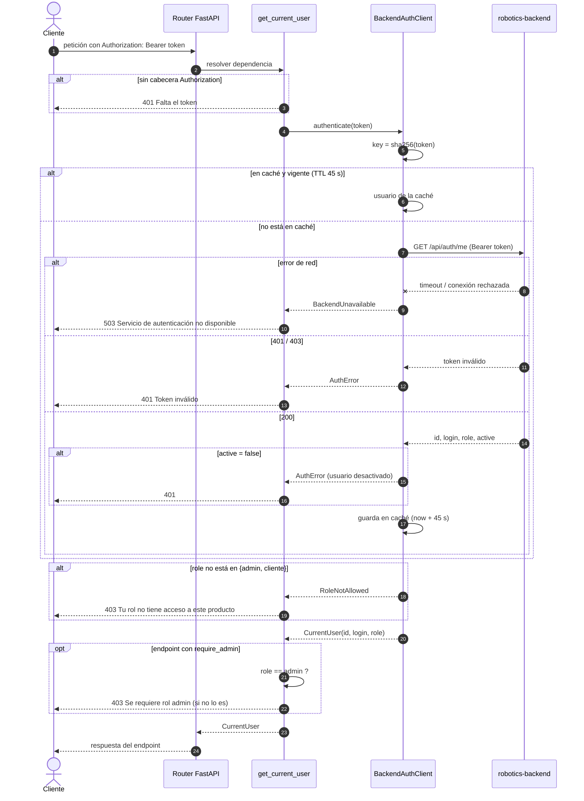
```mermaid
sequenceDiagram
    autonumber
    actor Cli as Cliente
    participant API as Router FastAPI
    participant Dep as get_current_user
    participant Auth as BackendAuthClient
    participant RB as robotics-backend

    Cli->>API: petición con Authorization: Bearer token
    API->>Dep: resolver dependencia
    alt sin cabecera Authorization
        Dep-->>Cli: 401 Falta el token
    end
    Dep->>Auth: authenticate(token)
    Auth->>Auth: key = sha256(token)
    alt en caché y vigente (TTL 45 s)
        Auth->>Auth: usuario de la caché
    else no está en caché
        Auth->>RB: GET /api/auth/me (Bearer token)
        alt error de red
            RB--xAuth: timeout / conexión rechazada
            Auth-->>Dep: BackendUnavailable
            Dep-->>Cli: 503 Servicio de autenticación no disponible
        else 401 / 403
            RB-->>Auth: token inválido
            Auth-->>Dep: AuthError
            Dep-->>Cli: 401 Token inválido
        else 200
            RB-->>Auth: id, login, role, active
            alt active = false
                Auth-->>Dep: AuthError (usuario desactivado)
                Dep-->>Cli: 401
            end
            Auth->>Auth: guarda en caché (now + 45 s)
        end
    end
    alt role no está en {admin, cliente}
        Auth-->>Dep: RoleNotAllowed
        Dep-->>Cli: 403 Tu rol no tiene acceso a este producto
    end
    Auth-->>Dep: CurrentUser(id, login, role)
    opt endpoint con require_admin
        Dep->>Dep: role == admin ?
        Dep-->>Cli: 403 Se requiere rol admin (si no lo es)
    end
    Dep-->>API: CurrentUser
    API-->>Cli: respuesta del endpoint
```

---

## 4. Alta y edición de cámaras

`app/api/routers/cameras.py`. Solo el admin crea y edita cámaras; cada acción queda en `audit_log`.

### 4.1 `POST /cameras`

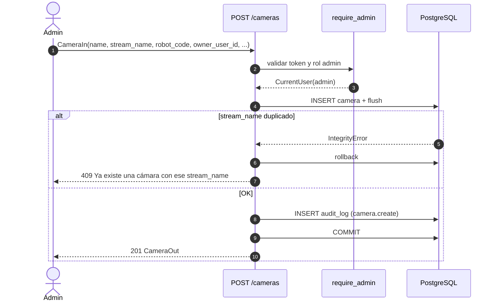
```mermaid
sequenceDiagram
    autonumber
    actor Adm as Admin
    participant API as POST /cameras
    participant Auth as require_admin
    participant DB as PostgreSQL

    Adm->>API: CameraIn(name, stream_name, robot_code, owner_user_id, ...)
    API->>Auth: validar token y rol admin
    Auth-->>API: CurrentUser(admin)
    API->>DB: INSERT camera + flush
    alt stream_name duplicado
        DB-->>API: IntegrityError
        API->>DB: rollback
        API-->>Adm: 409 Ya existe una cámara con ese stream_name
    else OK
        API->>DB: INSERT audit_log (camera.create)
        API->>DB: COMMIT
        API-->>Adm: 201 CameraOut
    end
```

### 4.2 `PATCH /cameras/{id}` (edición, reasignación, ingesta automática)

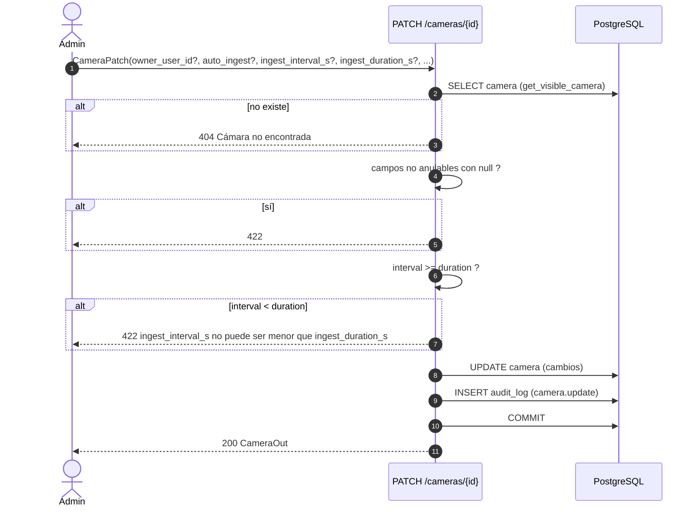
```mermaid
sequenceDiagram
    autonumber
    actor Adm as Admin
    participant API as PATCH /cameras/{id}
    participant DB as PostgreSQL

    Adm->>API: CameraPatch(owner_user_id?, auto_ingest?, ingest_interval_s?, ingest_duration_s?, ...)
    API->>DB: SELECT camera (get_visible_camera)
    alt no existe
        API-->>Adm: 404 Cámara no encontrada
    end
    API->>API: campos no anulables con null ?
    alt sí
        API-->>Adm: 422
    end
    API->>API: interval >= duration ?
    alt interval < duration
        API-->>Adm: 422 ingest_interval_s no puede ser menor que ingest_duration_s
    end
    API->>DB: UPDATE camera (cambios)
    API->>DB: INSERT audit_log (camera.update)
    API->>DB: COMMIT
    API-->>Adm: 200 CameraOut
```

---

## 5. Alta de un servicio de IA y activación en una cámara

`app/api/routers/detectors.py` y `cameras.py`. Un clip solo se envía a servicios **activados en la
cámara ∩ habilitados globalmente ∩ permitidos al dueño de la cámara**.

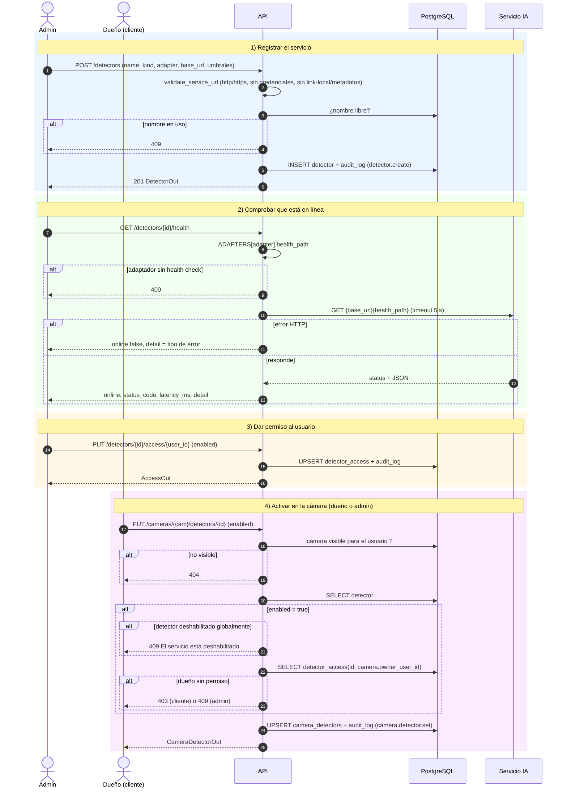
```mermaid
sequenceDiagram
    autonumber
    actor Adm as Admin
    actor Own as Dueño (cliente)
    participant API as API
    participant DB as PostgreSQL
    participant IA as Servicio IA

    rect rgb(235, 245, 255)
    Note over Adm,IA: 1) Registrar el servicio
    Adm->>API: POST /detectors (name, kind, adapter, base_url, umbrales)
    API->>API: validate_service_url (http/https, sin credenciales, sin link-local/metadatos)
    API->>DB: ¿nombre libre?
    alt nombre en uso
        API-->>Adm: 409
    end
    API->>DB: INSERT detector + audit_log (detector.create)
    API-->>Adm: 201 DetectorOut
    end

    rect rgb(240, 255, 240)
    Note over Adm,IA: 2) Comprobar que está en línea
    Adm->>API: GET /detectors/{id}/health
    API->>API: ADAPTERS[adapter].health_path
    alt adaptador sin health check
        API-->>Adm: 400
    end
    API->>IA: GET {base_url}{health_path} (timeout 5 s)
    alt error HTTP
        API-->>Adm: online false, detail = tipo de error
    else responde
        IA-->>API: status + JSON
        API-->>Adm: online, status_code, latency_ms, detail
    end
    end

    rect rgb(255, 248, 230)
    Note over Adm,IA: 3) Dar permiso al usuario
    Adm->>API: PUT /detectors/{id}/access/{user_id} (enabled)
    API->>DB: UPSERT detector_access + audit_log
    API-->>Adm: AccessOut
    end

    rect rgb(250, 235, 255)
    Note over Own,IA: 4) Activar en la cámara (dueño o admin)
    Own->>API: PUT /cameras/{cam}/detectors/{id} (enabled)
    API->>DB: cámara visible para el usuario ?
    alt no visible
        API-->>Own: 404
    end
    API->>DB: SELECT detector
    alt enabled = true
        alt detector deshabilitado globalmente
            API-->>Own: 409 El servicio está deshabilitado
        end
        API->>DB: SELECT detector_access(id, camera.owner_user_id)
        alt dueño sin permiso
            API-->>Own: 403 (cliente) o 409 (admin)
        end
    end
    API->>DB: UPSERT camera_detectors + audit_log (camera.detector.set)
    API-->>Own: CameraDetectorOut
    end
```

---

## 6. Solicitud manual de un clip

`POST /clips` (`app/api/routers/clips.py`). El clip queda `pending` y se despierta a los workers con
`NOTIFY clips_pending`.

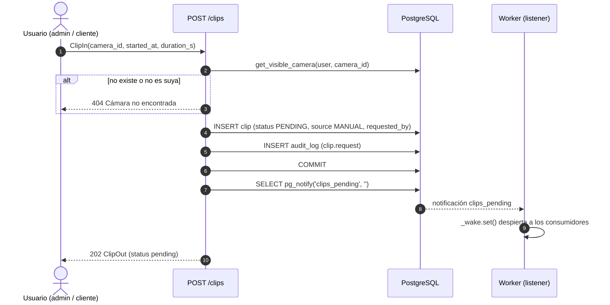
```mermaid
sequenceDiagram
    autonumber
    actor Cli as Usuario (admin / cliente)
    participant API as POST /clips
    participant DB as PostgreSQL
    participant W as Worker (listener)

    Cli->>API: ClipIn(camera_id, started_at, duration_s)
    API->>DB: get_visible_camera(user, camera_id)
    alt no existe o no es suya
        API-->>Cli: 404 Cámara no encontrada
    end
    API->>DB: INSERT clip (status PENDING, source MANUAL, requested_by)
    API->>DB: INSERT audit_log (clip.request)
    API->>DB: COMMIT
    API->>DB: SELECT pg_notify('clips_pending', '')
    DB-->>W: notificación clips_pending
    W->>W: _wake.set() despierta a los consumidores
    API-->>Cli: 202 ClipOut (status pending)
```

---

## 7. Ingesta automática programada

`Worker._ingest` cada 30 s alineado al reloj → `ingest_cameras` y `next_window`
(`app/ingest/scheduler.py`).

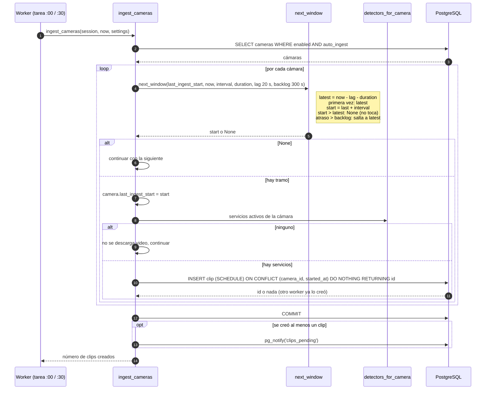
```mermaid
sequenceDiagram
    autonumber
    participant T as Worker (tarea :00 / :30)
    participant S as ingest_cameras
    participant NW as next_window
    participant Reg as detectors_for_camera
    participant DB as PostgreSQL

    T->>S: ingest_cameras(session, now, settings)
    S->>DB: SELECT cameras WHERE enabled AND auto_ingest
    DB-->>S: cámaras
    loop por cada cámara
        S->>NW: next_window(last_ingest_start, now, interval, duration, lag 20 s, backlog 300 s)
        Note right of NW: latest = now - lag - duration<br/>primera vez: latest<br/>start = last + interval<br/>start > latest: None (no toca)<br/>atraso > backlog: salta a latest
        NW-->>S: start o None
        alt None
            S->>S: continuar con la siguiente
        else hay tramo
            S->>S: camera.last_ingest_start = start
            S->>Reg: servicios activos de la cámara
            alt ninguno
                S->>S: no se descarga video, continuar
            else hay servicios
                S->>DB: INSERT clip (SCHEDULE) ON CONFLICT (camera_id, started_at) DO NOTHING RETURNING id
                DB-->>S: id o nada (otro worker ya lo creó)
            end
        end
    end
    S->>DB: COMMIT
    opt se creó al menos un clip
        S->>DB: pg_notify('clips_pending')
    end
    S-->>T: número de clips creados
```

---

## 8. Consumo de la cola (toma de un clip)

`Worker._consume` + `claim_next` (`app/queue.py`). La consulta respeta el **orden por cámara**: no toma
un clip si la misma cámara tiene uno anterior pendiente o en proceso (salvo que lleve más de
`CLIP_STALE_S` sin avanzar).

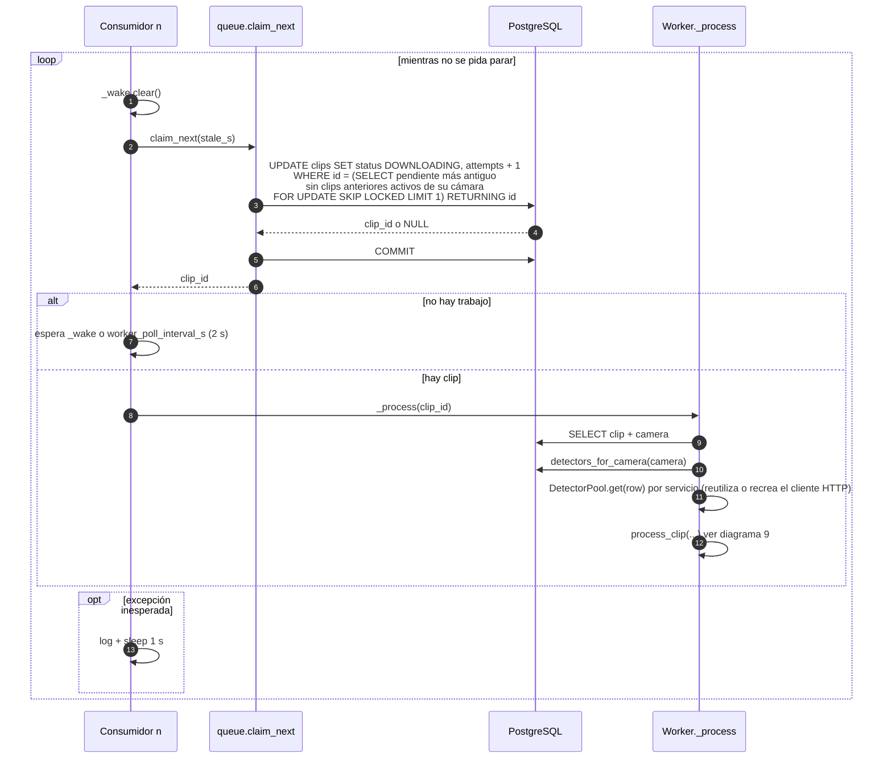
```mermaid
sequenceDiagram
    autonumber
    participant C as Consumidor n
    participant Q as queue.claim_next
    participant DB as PostgreSQL
    participant P as Worker._process

    loop mientras no se pida parar
        C->>C: _wake.clear()
        C->>Q: claim_next(stale_s)
        Q->>DB: UPDATE clips SET status DOWNLOADING, attempts + 1<br/>WHERE id = (SELECT pendiente más antiguo<br/>sin clips anteriores activos de su cámara<br/>FOR UPDATE SKIP LOCKED LIMIT 1) RETURNING id
        DB-->>Q: clip_id o NULL
        Q->>DB: COMMIT
        Q-->>C: clip_id
        alt no hay trabajo
            C->>C: espera _wake o worker_poll_interval_s (2 s)
        else hay clip
            C->>P: _process(clip_id)
            P->>DB: SELECT clip + camera
            P->>DB: detectors_for_camera(camera)
            P->>P: DetectorPool.get(row) por servicio (reutiliza o recrea el cliente HTTP)
            P->>P: process_clip(...) ver diagrama 9
        end
        opt excepción inesperada
            C->>C: log + sleep 1 s
        end
    end
```

---

## 9. Procesamiento de un clip

`process_clip` (`app/pipeline/runner.py`). Es el flujo central del sistema. Los datos de cada frame se
confirman en la BD **antes** de publicar sus eventos.

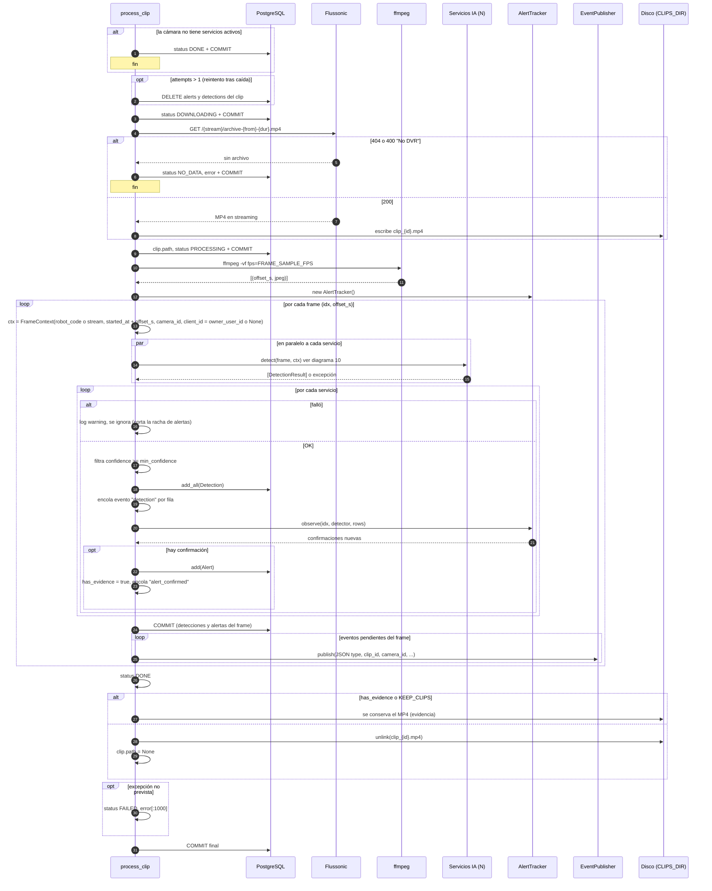
```mermaid
sequenceDiagram
    autonumber
    participant R as process_clip
    participant DB as PostgreSQL
    participant FL as Flussonic
    participant FF as ffmpeg
    participant IA as Servicios IA (N)
    participant AT as AlertTracker
    participant Pub as EventPublisher
    participant FS as Disco (CLIPS_DIR)

    alt la cámara no tiene servicios activos
        R->>DB: status DONE + COMMIT
        Note over R: fin
    end
    opt attempts > 1 (reintento tras caída)
        R->>DB: DELETE alerts y detections del clip
    end
    R->>DB: status DOWNLOADING + COMMIT
    R->>FL: GET /{stream}/archive-{from}-{dur}.mp4
    alt 404 o 400 "No DVR"
        FL-->>R: sin archivo
        R->>DB: status NO_DATA, error + COMMIT
        Note over R: fin
    else 200
        FL-->>R: MP4 en streaming
        R->>FS: escribe clip_{id}.mp4
    end
    R->>DB: clip.path, status PROCESSING + COMMIT
    R->>FF: ffmpeg -vf fps=FRAME_SAMPLE_FPS
    FF-->>R: [(offset_s, jpeg)]
    R->>AT: new AlertTracker()

    loop por cada frame (idx, offset_s)
        R->>R: ctx = FrameContext(robot_code o stream, started_at + offset_s, camera_id, client_id = owner_user_id o None)
        par en paralelo a cada servicio
            R->>IA: detect(frame, ctx) ver diagrama 10
            IA-->>R: [DetectionResult] o excepción
        end
        loop por cada servicio
            alt falló
                R->>R: log warning, se ignora (corta la racha de alertas)
            else OK
                R->>R: filtra confidence >= min_confidence
                R->>DB: add_all(Detection)
                R->>R: encola evento "detection" por fila
                R->>AT: observe(idx, detector, rows)
                AT-->>R: confirmaciones nuevas
                opt hay confirmación
                    R->>DB: add(Alert)
                    R->>R: has_evidence = true, encola "alert_confirmed"
                end
            end
        end
        R->>DB: COMMIT (detecciones y alertas del frame)
        loop eventos pendientes del frame
            R->>Pub: publish(JSON type, clip_id, camera_id, ...)
        end
    end

    R->>R: status DONE
    alt has_evidence o KEEP_CLIPS
        R->>FS: se conserva el MP4 (evidencia)
    else
        R->>FS: unlink(clip_{id}.mp4)
        R->>R: clip.path = None
    end
    opt excepción no prevista
        R->>R: status FAILED, error[:1000]
    end
    R->>DB: COMMIT final
```

---

## 10. Llamada a un servicio de detección

`HttpDetector.detect` (`app/detectors/http.py`) y adaptadores (`app/detectors/adapters.py`). El semáforo
limita las peticiones simultáneas por servicio (`max_concurrency`) en todo el proceso worker.

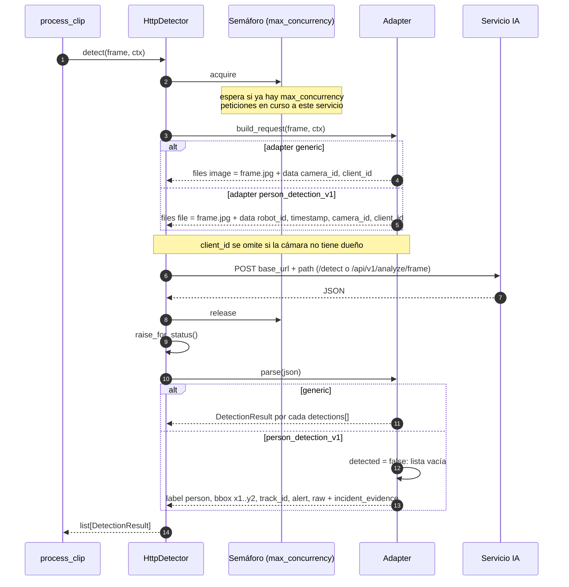
```mermaid
sequenceDiagram
    autonumber
    participant R as process_clip
    participant HD as HttpDetector
    participant Sem as Semáforo (max_concurrency)
    participant Ad as Adapter
    participant IA as Servicio IA

    R->>HD: detect(frame, ctx)
    HD->>Sem: acquire
    Note over Sem: espera si ya hay max_concurrency<br/>peticiones en curso a este servicio
    HD->>Ad: build_request(frame, ctx)
    alt adapter generic
        Ad-->>HD: files image = frame.jpg + data camera_id, client_id
    else adapter person_detection_v1
        Ad-->>HD: files file = frame.jpg + data robot_id, timestamp, camera_id, client_id
    end
    Note over Ad,HD: client_id se omite si la cámara no tiene dueño
    HD->>IA: POST base_url + path (/detect o /api/v1/analyze/frame)
    IA-->>HD: JSON
    HD->>Sem: release
    HD->>HD: raise_for_status()
    HD->>Ad: parse(json)
    alt generic
        Ad-->>HD: DetectionResult por cada detections[]
    else person_detection_v1
        Ad->>Ad: detected = false: lista vacía
        Ad-->>HD: label person, bbox x1..y2, track_id, alert, raw + incident_evidence
    end
    HD-->>R: list[DetectionResult]
```

---

## 11. Confirmación de alertas (AlertTracker)

`app/pipeline/alerts.py`. Una alerta se confirma cuando la misma clave `(detector, track_id, alert)`
aparece con `confidence >= alert_min_confidence` en `alert_min_frames` frames **consecutivos**. Se emite
una sola vez por racha; los frames siguientes de la racha solo se marcan `alert_confirmed`.

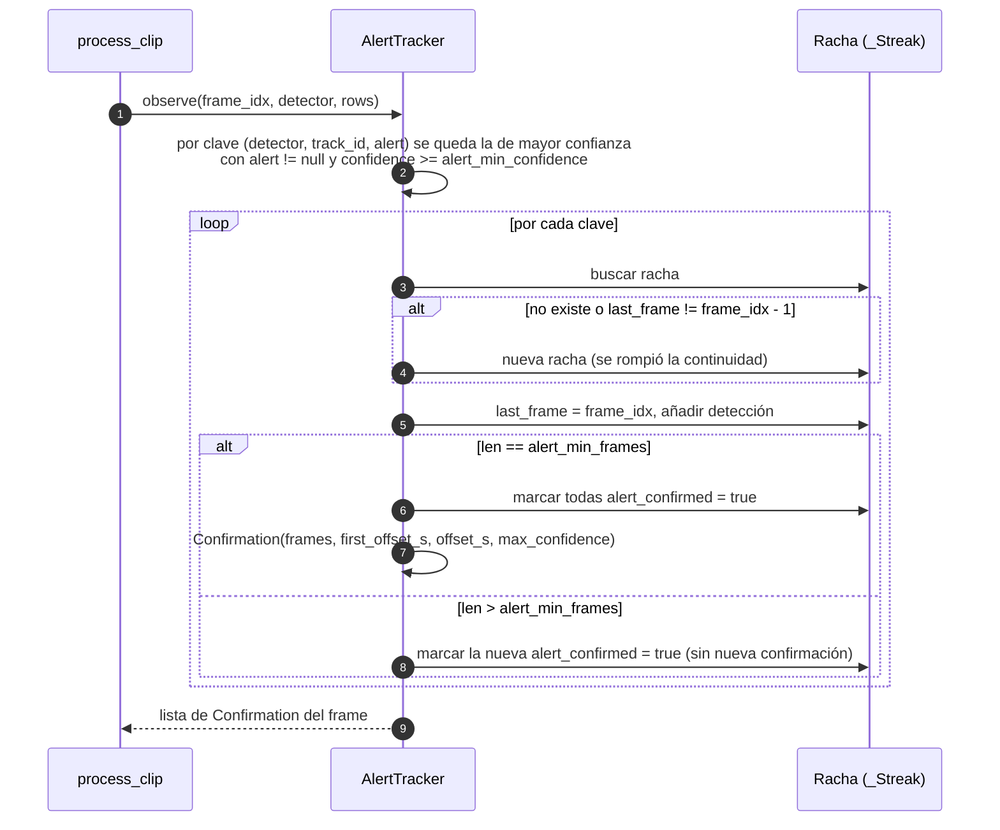
```mermaid
sequenceDiagram
    autonumber
    participant R as process_clip
    participant AT as AlertTracker
    participant St as Racha (_Streak)

    R->>AT: observe(frame_idx, detector, rows)
    AT->>AT: por clave (detector, track_id, alert) se queda la de mayor confianza<br/>con alert != null y confidence >= alert_min_confidence
    loop por cada clave
        AT->>St: buscar racha
        alt no existe o last_frame != frame_idx - 1
            AT->>St: nueva racha (se rompió la continuidad)
        end
        AT->>St: last_frame = frame_idx, añadir detección
        alt len == alert_min_frames
            AT->>St: marcar todas alert_confirmed = true
            AT->>AT: Confirmation(frames, first_offset_s, offset_s, max_confidence)
        else len > alert_min_frames
            AT->>St: marcar la nueva alert_confirmed = true (sin nueva confirmación)
        end
    end
    AT-->>R: lista de Confirmation del frame
```

---

## 12. Publicación y reparto de eventos en vivo

`PostgresEventPublisher` y `EventBus` (`app/events.py`). El worker (o la API, al atender alertas) publica
con `pg_notify` en una conexión propia en autocommit; la API escucha una sola vez por proceso y reparte a
la cola de cada WebSocket.

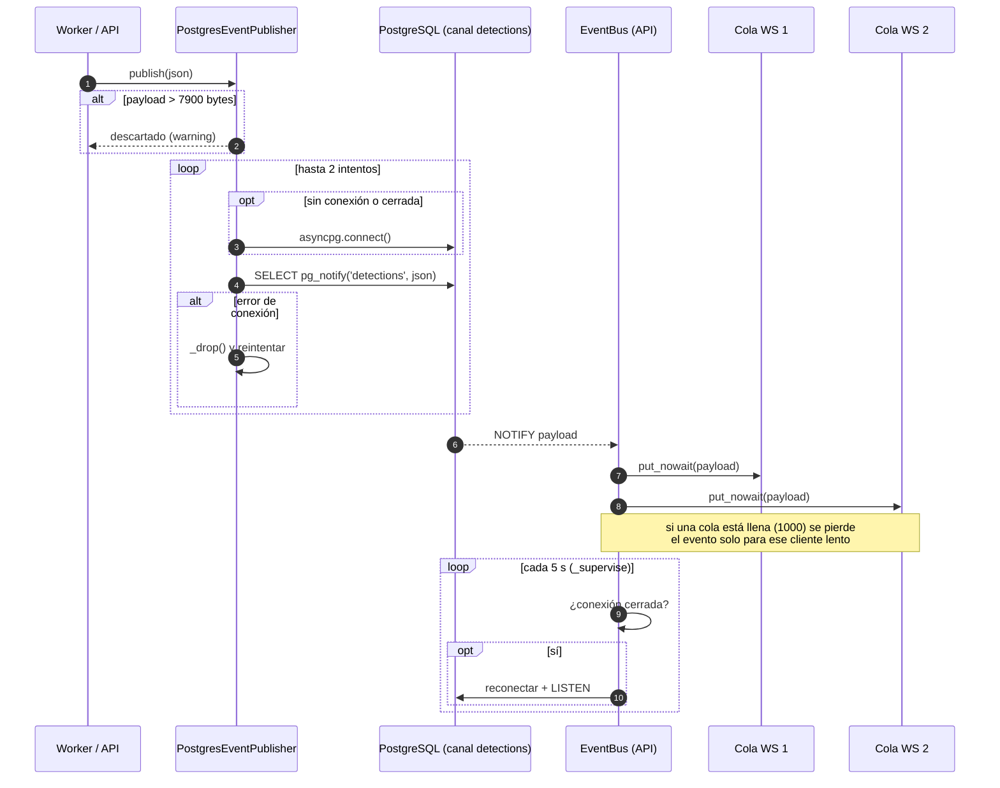
```mermaid
sequenceDiagram
    autonumber
    participant Src as Worker / API
    participant Pub as PostgresEventPublisher
    participant PG as PostgreSQL (canal detections)
    participant Bus as EventBus (API)
    participant Q1 as Cola WS 1
    participant Q2 as Cola WS 2

    Src->>Pub: publish(json)
    alt payload > 7900 bytes
        Pub-->>Src: descartado (warning)
    end
    loop hasta 2 intentos
        opt sin conexión o cerrada
            Pub->>PG: asyncpg.connect()
        end
        Pub->>PG: SELECT pg_notify('detections', json)
        alt error de conexión
            Pub->>Pub: _drop() y reintentar
        end
    end
    PG-->>Bus: NOTIFY payload
    Bus->>Q1: put_nowait(payload)
    Bus->>Q2: put_nowait(payload)
    Note over Bus,Q2: si una cola está llena (1000) se pierde<br/>el evento solo para ese cliente lento

    loop cada 5 s (_supervise)
        Bus->>Bus: ¿conexión cerrada?
        opt sí
            Bus->>PG: reconectar + LISTEN
        end
    end
```

---

## 13. Conexión WebSocket `/ws/events`

`app/api/routers/events.py`. Autenticación por primer mensaje, filtrado por cámaras del usuario
(`CameraAccess`) y revalidación del token cada 60 s.

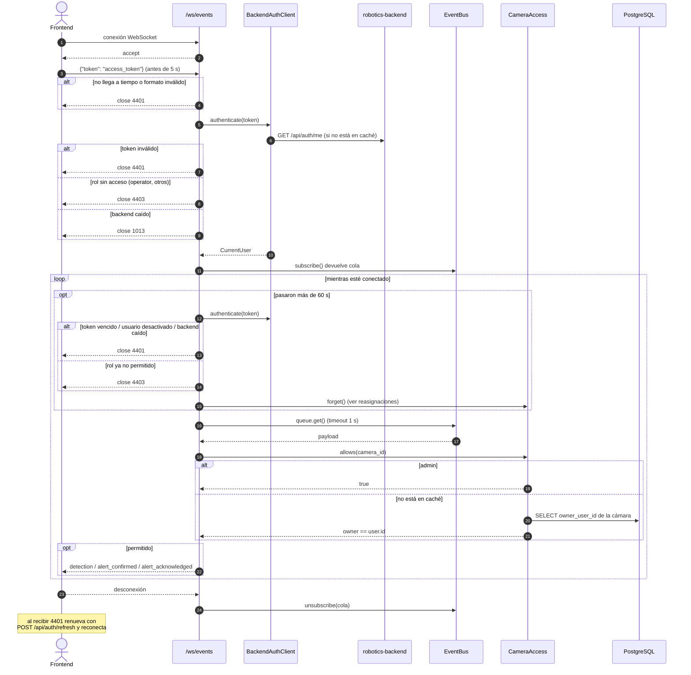
```mermaid
sequenceDiagram
    autonumber
    actor FE as Frontend
    participant WS as /ws/events
    participant Auth as BackendAuthClient
    participant RB as robotics-backend
    participant Bus as EventBus
    participant CA as CameraAccess
    participant DB as PostgreSQL

    FE->>WS: conexión WebSocket
    WS-->>FE: accept
    FE->>WS: {"token": "access_token"} (antes de 5 s)
    alt no llega a tiempo o formato inválido
        WS-->>FE: close 4401
    end
    WS->>Auth: authenticate(token)
    Auth->>RB: GET /api/auth/me (si no está en caché)
    alt token inválido
        WS-->>FE: close 4401
    else rol sin acceso (operator, otros)
        WS-->>FE: close 4403
    else backend caído
        WS-->>FE: close 1013
    end
    Auth-->>WS: CurrentUser
    WS->>Bus: subscribe() devuelve cola

    loop mientras esté conectado
        opt pasaron más de 60 s
            WS->>Auth: authenticate(token)
            alt token vencido / usuario desactivado / backend caído
                WS-->>FE: close 4401
            else rol ya no permitido
                WS-->>FE: close 4403
            end
            WS->>CA: forget() (ver reasignaciones)
        end
        WS->>Bus: queue.get() (timeout 1 s)
        Bus-->>WS: payload
        WS->>CA: allows(camera_id)
        alt admin
            CA-->>WS: true
        else no está en caché
            CA->>DB: SELECT owner_user_id de la cámara
            CA-->>WS: owner == user.id
        end
        opt permitido
            WS-->>FE: detection / alert_confirmed / alert_acknowledged
        end
    end
    FE-->>WS: desconexión
    WS->>Bus: unsubscribe(cola)
    Note over FE: al recibir 4401 renueva con<br/>POST /api/auth/refresh y reconecta
```

---

## 14. Atender una alerta

`POST /alerts/{id}/acknowledge` (`app/api/routers/alerts.py`). Es idempotente: no sobrescribe quién la
atendió primero. Notifica a las demás pantallas con `alert_acknowledged`.

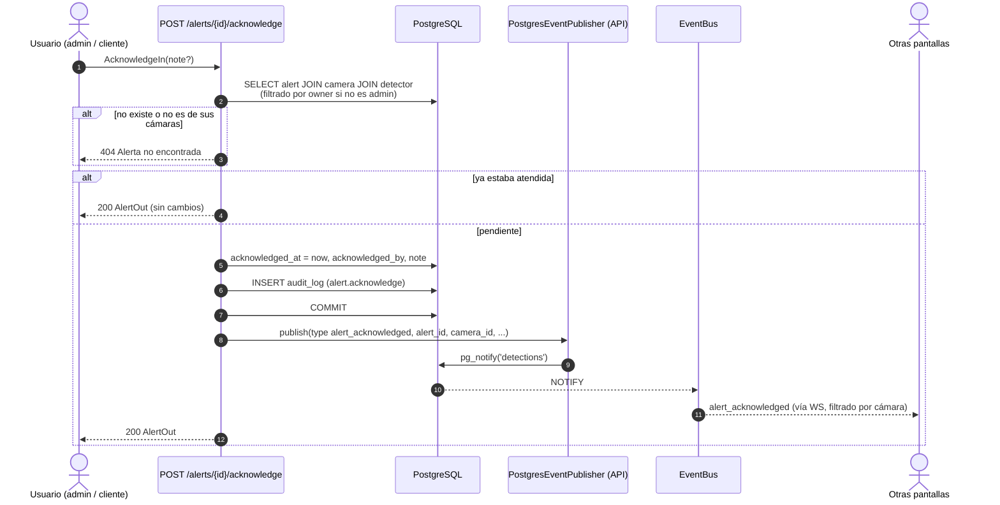
```mermaid
sequenceDiagram
    autonumber
    actor Op as Usuario (admin / cliente)
    participant API as POST /alerts/{id}/acknowledge
    participant DB as PostgreSQL
    participant Pub as PostgresEventPublisher (API)
    participant Bus as EventBus
    actor Otros as Otras pantallas

    Op->>API: AcknowledgeIn(note?)
    API->>DB: SELECT alert JOIN camera JOIN detector<br/>(filtrado por owner si no es admin)
    alt no existe o no es de sus cámaras
        API-->>Op: 404 Alerta no encontrada
    end
    alt ya estaba atendida
        API-->>Op: 200 AlertOut (sin cambios)
    else pendiente
        API->>DB: acknowledged_at = now, acknowledged_by, note
        API->>DB: INSERT audit_log (alert.acknowledge)
        API->>DB: COMMIT
        API->>Pub: publish(type alert_acknowledged, alert_id, camera_id, ...)
        Pub->>DB: pg_notify('detections')
        DB-->>Bus: NOTIFY
        Bus-->>Otros: alert_acknowledged (vía WS, filtrado por cámara)
        API-->>Op: 200 AlertOut
    end
```

---

## 15. Consulta de historial (clips, detecciones, alertas)

`GET /clips`, `GET /detections`, `GET /alerts` comparten el mismo patrón: filtros opcionales, alcance
por dueño de la cámara, total en `X-Total-Count` y paginación.

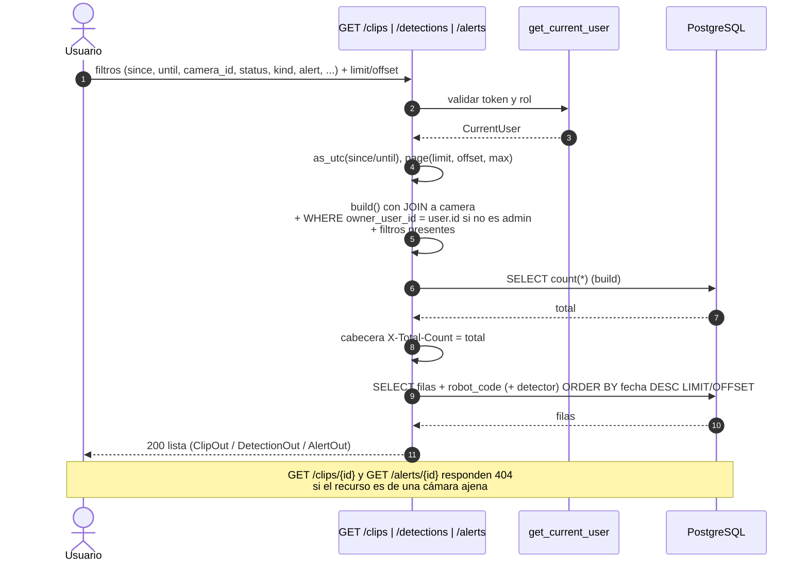
```mermaid
sequenceDiagram
    autonumber
    actor Cli as Usuario
    participant API as GET /clips | /detections | /alerts
    participant Auth as get_current_user
    participant DB as PostgreSQL

    Cli->>API: filtros (since, until, camera_id, status, kind, alert, ...) + limit/offset
    API->>Auth: validar token y rol
    Auth-->>API: CurrentUser
    API->>API: as_utc(since/until), page(limit, offset, max)
    API->>API: build() con JOIN a camera<br/>+ WHERE owner_user_id = user.id si no es admin<br/>+ filtros presentes
    API->>DB: SELECT count(*) (build)
    DB-->>API: total
    API->>API: cabecera X-Total-Count = total
    API->>DB: SELECT filas + robot_code (+ detector) ORDER BY fecha DESC LIMIT/OFFSET
    DB-->>API: filas
    API-->>Cli: 200 lista (ClipOut / DetectionOut / AlertOut)

    Note over Cli,DB: GET /clips/{id} y GET /alerts/{id} responden 404<br/>si el recurso es de una cámara ajena
```

---

## 16. Resumen estadístico `/stats/summary`

`app/api/routers/stats.py`. Ventana por defecto de 7 días (máx. 366), agrupación diaria en la zona
horaria `tz` que valida PostgreSQL.

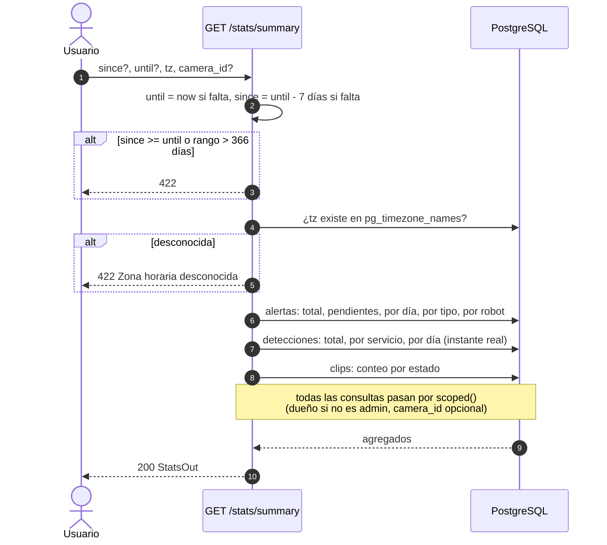
```mermaid
sequenceDiagram
    autonumber
    actor Cli as Usuario
    participant API as GET /stats/summary
    participant DB as PostgreSQL

    Cli->>API: since?, until?, tz, camera_id?
    API->>API: until = now si falta, since = until - 7 días si falta
    alt since >= until o rango > 366 días
        API-->>Cli: 422
    end
    API->>DB: ¿tz existe en pg_timezone_names?
    alt desconocida
        API-->>Cli: 422 Zona horaria desconocida
    end
    API->>DB: alertas: total, pendientes, por día, por tipo, por robot
    API->>DB: detecciones: total, por servicio, por día (instante real)
    API->>DB: clips: conteo por estado
    Note over API,DB: todas las consultas pasan por scoped()<br/>(dueño si no es admin, camera_id opcional)
    DB-->>API: agregados
    API-->>Cli: 200 StatsOut
```

---

## 17. Recuperación de clips atascados

`Worker._recover` cada 60 s → `recover_stale` (`app/queue.py`). Un clip en `DOWNLOADING`/`PROCESSING`
sin avanzar más de `CLIP_STALE_S` (600 s) se considera abandonado por un worker caído.

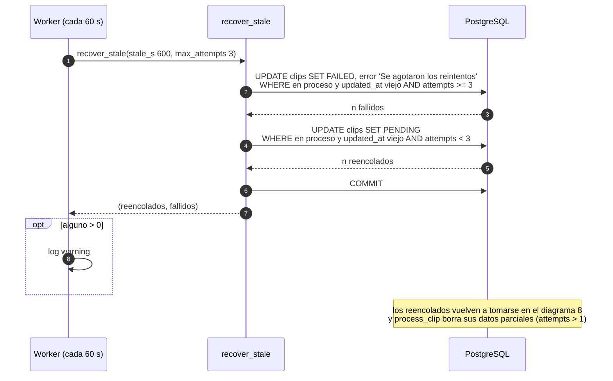
```mermaid
sequenceDiagram
    autonumber
    participant T as Worker (cada 60 s)
    participant Q as recover_stale
    participant DB as PostgreSQL

    T->>Q: recover_stale(stale_s 600, max_attempts 3)
    Q->>DB: UPDATE clips SET FAILED, error 'Se agotaron los reintentos'<br/>WHERE en proceso y updated_at viejo AND attempts >= 3
    DB-->>Q: n fallidos
    Q->>DB: UPDATE clips SET PENDING<br/>WHERE en proceso y updated_at viejo AND attempts < 3
    DB-->>Q: n reencolados
    Q->>DB: COMMIT
    Q-->>T: (reencolados, fallidos)
    opt alguno > 0
        T->>T: log warning
    end
    Note over DB: los reencolados vuelven a tomarse en el diagrama 8<br/>y process_clip borra sus datos parciales (attempts > 1)
```

---

## 18. Limpieza nocturna de videos

`Worker._cleanup_nightly` (se evalúa cada 60 s, se ejecuta una vez al día a las 03:00 hora local) →
`cleanup_old_clips` (`app/pipeline/housekeeping.py`).

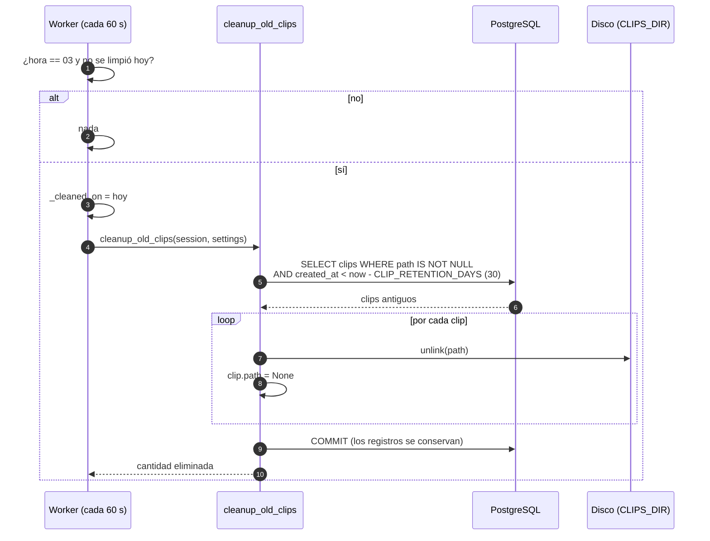
```mermaid
sequenceDiagram
    autonumber
    participant T as Worker (cada 60 s)
    participant H as cleanup_old_clips
    participant DB as PostgreSQL
    participant FS as Disco (CLIPS_DIR)

    T->>T: ¿hora == 03 y no se limpió hoy?
    alt no
        T->>T: nada
    else sí
        T->>T: _cleaned_on = hoy
        T->>H: cleanup_old_clips(session, settings)
        H->>DB: SELECT clips WHERE path IS NOT NULL<br/>AND created_at < now - CLIP_RETENTION_DAYS (30)
        DB-->>H: clips antiguos
        loop por cada clip
            H->>FS: unlink(path)
            H->>H: clip.path = None
        end
        H->>DB: COMMIT (los registros se conservan)
        H-->>T: cantidad eliminada
    end
```

---

## 19. Anexo: ciclo de vida de un clip

Resumen de los estados de `clips.status` que recorren los diagramas 6 a 9 y 17.

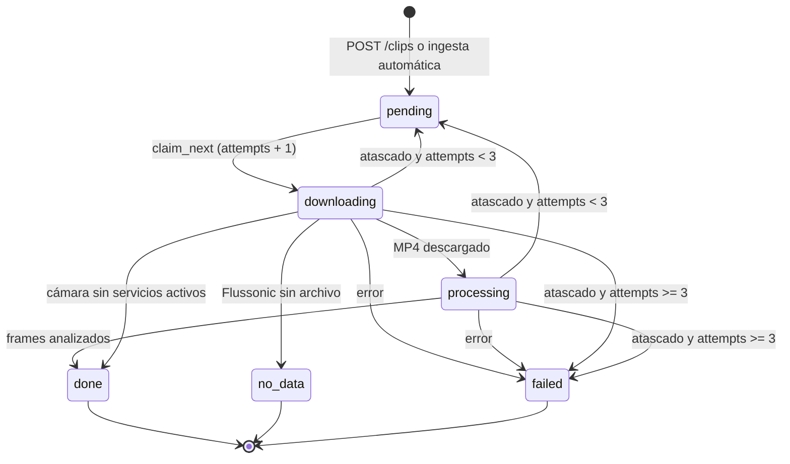
```mermaid
stateDiagram-v2
    [*] --> pending: POST /clips o ingesta automática
    pending --> downloading: claim_next (attempts + 1)
    downloading --> processing: MP4 descargado
    downloading --> no_data: Flussonic sin archivo
    processing --> done: frames analizados
    downloading --> done: cámara sin servicios activos
    downloading --> failed: error
    processing --> failed: error
    downloading --> pending: atascado y attempts < 3
    processing --> pending: atascado y attempts < 3
    downloading --> failed: atascado y attempts >= 3
    processing --> failed: atascado y attempts >= 3
    done --> [*]
    no_data --> [*]
    failed --> [*]
```
